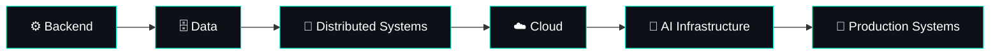

<!-- ===================== ANIMATED HEADER ===================== -->

<div align="center">


<a href="https://git.io/typing-svg">

</a>

<br/>


<br/><br/>


</div>

---

<!-- ===================== ABOUT ===================== -->

##  `whoami`

```yaml
name: Jayesh Pandey
role: Software Engineer
location: India

building:
  - Backend Systems
  - Cloud Infrastructure
  - AI/ML Applications

exploring:
  - Distributed Systems
  - Database Internals
  - System Design
  - ML Infrastructure

philosophy: "Understand the system. Then make it scale."
```

<div align="center">

### ⚡ Backend × Cloud × Distributed Systems × AI


</div>

---

<!-- ===================== ABOUT SCRIPT ===================== -->

##  `./about_me.sh`

```text
┌──(jayesh㉿github)-[~/about]
└─$ cat engineer.txt

⚙️  Building backend systems with Node.js & TypeScript
☁️  Working with AWS infrastructure and containerized workloads
🏗️  Interested in scalable & distributed system architecture
🧠  Exploring databases, caching, messaging and system internals
🤖  Building with Computer Vision, VLMs and AI/ML
🔬  Curious about what happens underneath the abstraction

┌──(jayesh㉿github)-[~/about]
└─$ _
```

---

<!-- ===================== TECH STACK ===================== -->

##  `tech --stack`

<div align="center">

### ⚙️ Backend


<br/><br/>

### 🗄️ Data


<br/><br/>

### ☁️ Cloud & Infrastructure


<br/><br/>

### 🤖 AI / ML


</div>

---

<!-- ===================== EXPERIENCE MATRIX ===================== -->

##  `cat /etc/engineering-stack`

```text
╭──────────────────────┬────────────────────────────────────────────╮
│ DOMAIN               │ TECHNOLOGIES                               │
├──────────────────────┼────────────────────────────────────────────┤
│ Backend              │ Node.js • TypeScript • Fastify • REST      │
│ Cloud                │ AWS • CDK • ECS • Fargate • ECR • Lambda   │
│ Infrastructure       │ Docker • CI/CD • Linux • CloudWatch        │
│ Databases            │ PostgreSQL • MongoDB • Redis               │
│ Search / Logging     │ Elasticsearch • Logstash • Kibana          │
│ AI / Computer Vision │ CNN • VLM • YOLO • OpenCV                  │
│ Video / Streaming    │ HLS • FFmpeg • PyAV • WebSockets           │
╰──────────────────────┴────────────────────────────────────────────╯
```

---

<!-- ===================== ARCHITECTURE FLOW ===================== -->

##  `cat journey.graph`



<div align="center">

> *I'm interested in the point where software engineering, distributed infrastructure and machine learning collide.*

</div>

---

<!-- ===================== CURRENTLY LEARNING ===================== -->

##  `ps aux | grep learning`

```text
PID      PROCESS                     STATUS
──────────────────────────────────────────────
1337     System Design               ███████████████████░
2048     Distributed Systems         ██████████████████░░
4096     Database Engineering        █████████████████░░░
8192     Cloud Architecture          ███████████████████░
16384    ML Infrastructure           ███████████████░░░░░
```

---

<!-- ===================== STATS ===================== -->

##  `github --stats`

<div align="center">


<br/>


</div>

---

<!-- ===================== TROPHIES ===================== -->

##  `github --achievements`

<div align="center">


</div>

---

<!-- ===================== ACTIVITY GRAPH ===================== -->

##  `git log --visualize`

<div align="center">


</div>

---

<!-- ===================== SNAKE ===================== -->

## `./consume_contributions.sh`

<div align="center">


</div>

---

<!-- ===================== RANDOM DEV QUOTE ===================== -->

<div align="center">

### `while (alive) { learn(); build(); improve(); }`

<br/>


</div>

---

<!-- ===================== CONNECT ===================== -->

## `./connect.sh`

<div align="center">

<a href="https://www.linkedin.com/in/jayesh-pandey-486277230/">

</a>

<a href="mailto:j.r.n.pandey@gmail.com">

</a>

<a href="https://github.com/jayesh-RN">

</a>

<br/><br/>


</div>

<!-- ===================== FOOTER ===================== -->


